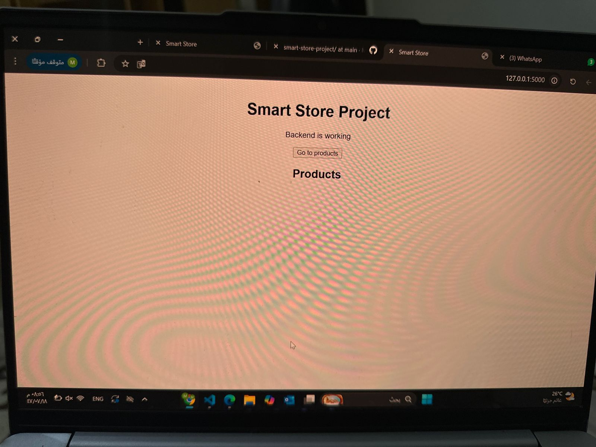
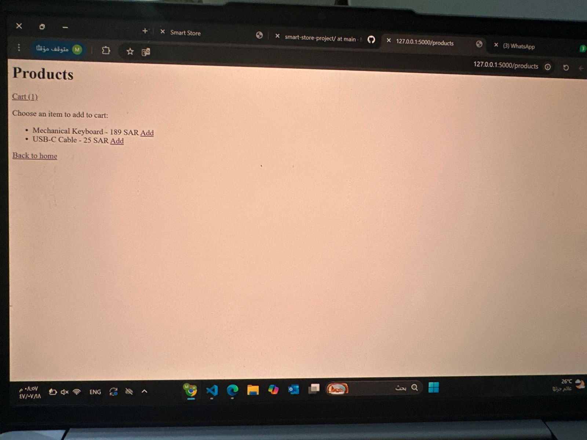
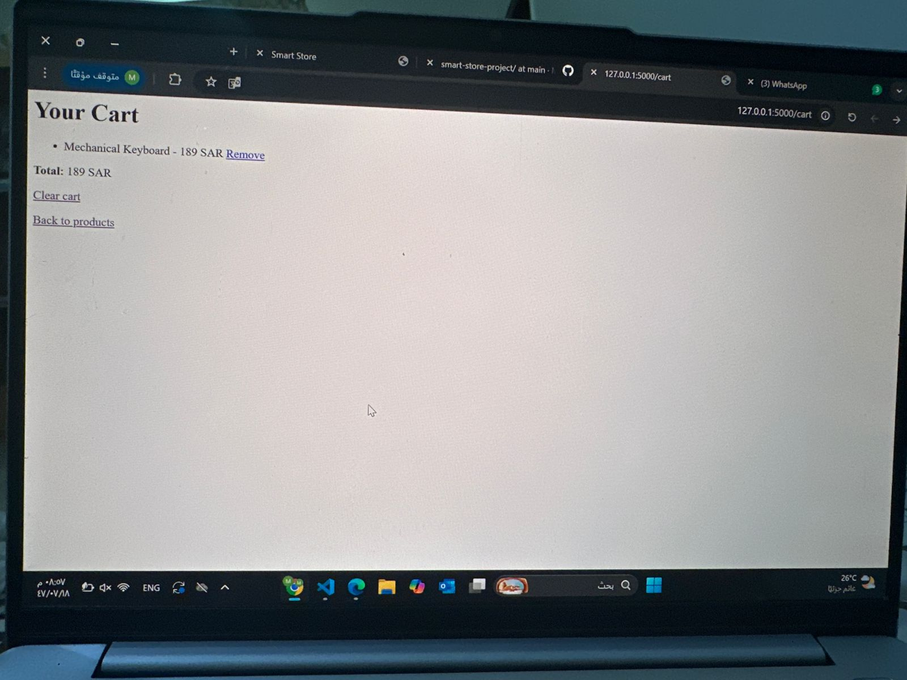

# Smart Store Project (Flask)

Simple mini e-commerce demo built with Flask:
- View products
- Add to cart (session-based)
- Remove items
- Clear cart
- Show cart total

## Tech
- Python + Flask
- Jinja2 templates
- Session storage (no database yet)

## Features
- Products page with dynamic list
- Cart page with item list + total
- Remove by index
- Clear cart

## Project Structure
smart-store-project/
app.py
templates/
index.html
products.html
cart.html
static/
style.css

## Run Locally
1) Install dependencies:   
```bash
pip install flask
python app.py
```
2. Run the app:
```bash
python app.py
```
3 Open in browser:
•	Home: http://127.0.0.1:5000/
	•	Products: http://127.0.0.1:5000/products
	•	Cart: http://127.0.0.1:5000/cart

Notes
	•	Cart is stored using Flask session (browser-based).
	•	No database is used in this version.
	•	Project focuses on backend logic and routing


## Screenshots

### Home Page


### Products Page


### Cart Page

